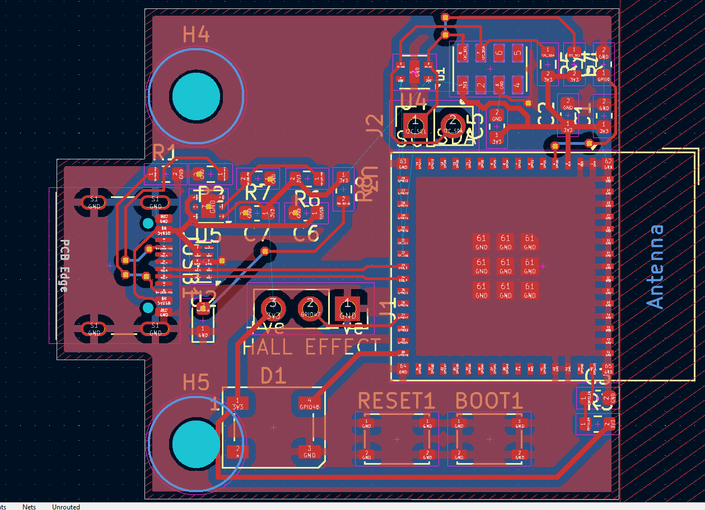

## Weather Station

# Day 1 - June 21st(Schematic and Layout)

Today was a pretty chill intro day to this project - I watched a couple of videos on weather stations and figured out that I wanted to challenge myself this time - by making a custom esp32 board for this weather station 
To do this, I started out with my schematic 

I'm using an ESP32S3 SOC for the actual processing stuff and this very interesting i2c temperature, humidity and pressure sensor, the MS8670.  
For the wind speed device, the anemometer, I'll be using a hall effect to measure rotations 
I have not decided on if i'm going to incorporate rain into this thing 
**Time Spent: 4hr** 

# Day 2 - June 25th(PCB Routing and stuff)

Today, I only did my layout and routing(surprisingly took forever) 
Organized everything by module and tried to keep it as small as I physically could 
Ended up with this: 

and I'm pretty proud of it, especially the size. 
It does have an extra header for i2c JUST in case I want to add some new stuff to this. 
**Time Spent:3.5hr**
